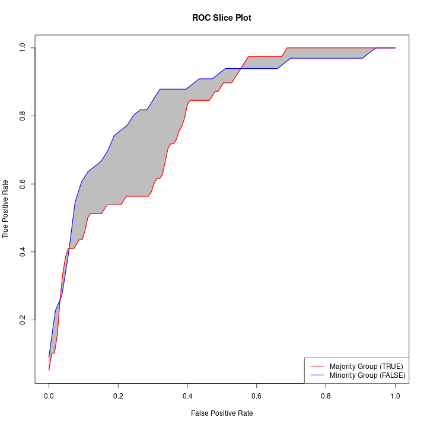

```{r include=FALSE}
set.seed(4803232)
library(tidyverse)
german_credit <- read.table("german.data")
colnames(german_credit) <- c("chk_acct", "duration", "credit_his", "purpose", 
                            "amount", "saving_acct", "present_emp", "installment_rate", "sex", "other_debtor", 
                            "present_resid", "property", "age", "other_install", "housing", "n_credits", 
                            "job", "n_people", "telephone", "foreign", "response")

german_credit$response <- german_credit$response - 1
german_credit$response <- as.factor(german_credit$response)
```

## Introduction

In this short lecture, we'll discuss issues at the intersection of machine learning and fairness. In particular, we will cover:

* What is a machine learning model?
* Evaluating machine learning models
* Auditing for algorithmic bias via "slicing analysis" 
* A case study using real-world data in R

# What is a machine learning model?

## Machine Learning Model

* A mathematical **function** that relates **inputs** to **outputs**.
* We can represent this as $\hat{y} = f_{\theta}(x)$, where:
  * $\hat{y}$ is the prediction for a given input (our **estimate** of the true label $y$)
  * $f_{\theta}$ is our "model" with parameters $\theta$ that control its predictions
  * $x$ is an input observation

## An example model

Consider a model where our goal is to predict whether a loan applicant is "high" or "low" risk, using a historical dataset of loan applications as follows:

* $x$ is a set of features about the loan applicant (checking & savings account status, age job, etc.).
* $y$ is whether that individual was a high or low risk (i.e., whether they defaulted on a loan).

We can use this data to "train" a model $f_\theta$ to predict the creditworthiness of future applicants from this same set of features.

## An example dataset

We'll consider the German Credit Dataset.

```{r}
german_credit %>% 
  select(c("chk_acct", "duration", "credit_his", "purpose", 
           "amount", "present_emp", "sex", "age", "response")) %>%
  str()
```

## Training our model

Below, we train a prediction model using the XGBoost algorithm to predict credit risk from the input features.

This is an important task, and the input features here are sensitive (and legally-protected in the United States). How do we know whether this model is "good", or "fair"?

```{r cache=TRUE, include=FALSE}
n = nrow(german_credit)
train_idxs = sample.int(n, size = 0.75 * n)
german_train = german_credit[train_idxs, ]
german_test = german_credit[-train_idxs, ]
```

```{r cache=TRUE, include=FALSE, results='hide'}
library(caret)

control <- trainControl(method='repeatedcv', 
                        number=10, 
                        repeats=3)

#Metric compare model is Accuracy
metric <- "Accuracy"
set.seed(123)

# Specify cross-validation method and number of folds. Also enable parallel computation

xgb_trcontrol = trainControl(
  method = "cv",
  number = 5,  
  allowParallel = TRUE,
  verboseIter = FALSE,
  returnData = FALSE
)

xgbGrid <- expand.grid(nrounds = c(100,200),  # aka n_estimators
                       max_depth = c(10, 15, 20, 25),
                       colsample_bytree = seq(0.5, 0.9, length.out = 5),
                       ## The values below are default values in the sklearn-api. 
                       eta = 0.1,
                       gamma=0,
                       min_child_weight = 1,
                       subsample = 1
                      )
```

```{r cache=TRUE, results='hide'}
xgb_model <- train(response~.,
                   data=german_train,
                   metric='Accuracy', 
                   trControl = xgb_trcontrol,
                   tuneGrid = xgbGrid,
                   method = "xgbTree")
```


# Evaluating machine learning models

## Measuring model performance

Typically, we use a "test" dataset -- a set of unseen data not used for training -- to evaluate the quality of our model. 

Using this test set, we make *predictions* $f_{\theta}(x_i)$ for each element $x_i$ in the test set, and compare this to the true labels $y_i$.

From this set of paired predictions and labels, we compute metrics to measure model performance. Common metrics for classification tasks include:

* **Accuracy**
* **Cross-entropy**
* Metrics from the **confusion matrix**, including:
  - **False Positive Rate (FPR)**
  - **True Positive Rate (TPR)**

## Inspecting our model's performance

**Predictions and Labels**

```{r, cache=TRUE, include=FALSE}

preds = predict(xgb_model, select(german_test, -c("response")))
pred_probas = unname(predict(xgb_model, select(german_test, -c("response")), type="prob"))
labs = german_test$response
```

```{r, cache=TRUE}
head(labs, n=20)  # The true labels
head(preds, n=20) # Our model's predictions
```

## Inspecting our model's performance

```{r, cache=TRUE, include=FALSE}
library(rlist)
cm = caret::confusionMatrix(preds, reference = labs)
```

**Confusion Matrix:**

```{r cache=TRUE, echo=FALSE}
cm[["table"]]
```

**Model Performance:**

```{r cache=TRUE, echo=FALSE}
by_class = cm[["byClass"]][c("Sensitivity", "Specificity")]
by_class = plyr::rename(by_class, c("Sensitivity" = "TPR", "Specificity" = "TNR"))
by_class[["FPR"]] = 1 - by_class[["TNR"]]
by_class[["Accuracy"]] = cm[["overall"]]["Accuracy"]
by_class = list.remove(by_class, "TNR")
by_class
```
  
## The Receiver Operating Characteristic (ROC) Curve

```{r, echo=FALSE, results=FALSE, message=FALSE}
library("ROCR")
compute_roc <- function(preds, labs) {
    # create prediction object
    pred <- ROCR::prediction(preds, labs)
    perf <- ROCR::performance(pred, "tpr", "fpr")
    return(perf)
}

compute_auc <- function(preds, labs) {
    predobj <- ROCR::prediction(preds, labs)
    aucobj <- ROCR::performance(predobj, measure = "auc")
    auc <- aucobj@y.values[[1]]
    return(auc)
}

interpolate_roc_fun <- function(perf_in, n_grid = 10000) {
    x_vals <- unlist(perf_in@x.values)
    y_vals <- unlist(perf_in@y.values)
    stopifnot(length(x_vals) == length(y_vals))
    roc_approx <- stats::approx(x_vals, y_vals, n = n_grid)
    return(roc_approx)
}

roc_plot <- function(preds, labs, plot_type = NULL, show_diag = FALSE,
                     fout = NULL){
    if (!is.null(fout)) {
        grDevices::png(fout, width = 720, height = 720)
    }
    if (plot_type == "majority"){
        plot_color <- "red"
    } else if (plot_type == "minority"){
        plot_color <- "blue"
    } else{
        plot_color <- "black"
    }
    roc <- compute_roc(preds, labs)
    auc <- round(compute_auc(preds, labs), 3)
    coords <- interpolate_roc_fun(roc)
    graphics::plot(coords[["x"]], coords[["y"]], type = "l", lwd = 1.5,
         xlab = "False Positive Rate", ylab = "True Positive Rate",
         col = plot_color,
         main = glue::glue(
             "Receiver Operating Characteristic Curve\nAUC = {auc}"))
    graphics::polygon(x = c(coords[["x"]], 1.0, 0.0),
                      y = c(coords[["y"]], 0.0, 0.0),
                      col = "grey", border = NA)
    graphics::lines(coords[["x"]], coords[["y"]], type = "l", lwd = 1.5,
                    col = plot_color)
    if (show_diag == TRUE){
        graphics::abline(a = 0, b = 1, col = "black", lwd = 0.5, lty = "dashed")
    }
    if (!is.null(fout)) {
        grDevices::dev.off()
    }

}

slice_plot <- function(majority_roc, minority_roc, majority_group_name = NULL,
                       minority_group_name = NULL, fout = NULL) {
    # check that number of points are the same
    stopifnot(length(majority_roc$x) == length(majority_roc$y),
              length(majority_roc$x) == length(minority_roc$x),
              length(majority_roc$x) == length(minority_roc$y))
    if (!is.null(fout)) {
        grDevices::png(fout, width = 720, height = 720)
    }
    # set some graph parameters
    majority_color <- "red"
    minority_color <- "blue"
    majority_group_label <- "Majority Group"
    minority_group_label <- "Minority Group"
    plot_title <- "ROC Slice Plot"
    if (!is.null(majority_group_name)) {
        majority_group_label <- glue::glue(
            "{majority_group_label} ({majority_group_name})")
    }
    if (!is.null(minority_group_name)) {
        minority_group_label <- glue::glue(
            "{minority_group_label} ({minority_group_name})")
    }
    # add labels, if given
    graphics::plot(majority_roc$x, majority_roc$y, col = majority_color,
                   type = "l", lwd = 1.5, main = plot_title,
                   xlab = "False Positive Rate", ylab = "True Positive Rate")
    # draw polygon; reverse ordering used to close polygon by ending near start
    # point
    graphics::polygon(x = c(majority_roc$x, rev(minority_roc$x)),
                      y = c(majority_roc$y, rev(minority_roc$y)),
                      col = "grey", border = NA)
    graphics::lines(majority_roc$x, majority_roc$y, col = majority_color,
                    type = "l", lwd = 1.5)
    graphics::lines(minority_roc$x, minority_roc$y, col = minority_color,
                    type = "l", lwd = 1.5)
    graphics::legend("bottomright",
                     legend = c(majority_group_label, minority_group_label),
                     col = c(majority_color, minority_color), lty = 1)
    if (!is.null(fout)) {
        grDevices::dev.off()
    }
}


compute_abroca <- function(df, pred_col, label_col, protected_attr_col,
                           majority_protected_attr_val, n_grid = 10000,
                           plot_slices = TRUE, image_dir = NULL,
                           identifier = NULL) {
    # input checking pred_col should be in interval [0,1]
    if (!all(df[, pred_col] <= 1 & df[, pred_col] >= 0)) stop(
        "predictions must be in range[0, 1]")
    if (!length(unique(df[, label_col]) == 2)) stop(
        "only binary classification tasks supported")
    if (!is.factor(df[, protected_attr_col])){
        message(glue::glue(
            "[WARNING] coercing column {protected_attr_col} to factor"))
        df[, protected_attr_col] <- as.factor(df[, protected_attr_col])
    }
    # initialize data structures
    ss <- 0
    p_a_values <- unique(df[, protected_attr_col])
    roc_list <- list()
    # compute roc within each group of p_a_values
    for (p_a_value in p_a_values) {
        protected_attr_df <- df[df[, protected_attr_col] ==
                                   p_a_value, ]
        roc_list[[p_a_value]] <- compute_roc(
            protected_attr_df[, pred_col],
            protected_attr_df[, label_col]
            )
    }
    # compare each non-majority class to majority class; accumulate absolute
    # difference between ROC curves to slicing statistic
    majority_roc_fun <- interpolate_roc_fun(
        roc_list[[majority_protected_attr_val]]
        )
    for (p_a_value in p_a_values[p_a_values != majority_protected_attr_val]) {
        minority_roc_fun <- interpolate_roc_fun(roc_list[[p_a_value]])
        # use function approximation to compute slice statistic
        # via piecewise linear function
        stopifnot(identical(majority_roc_fun$x, minority_roc_fun$x))
        f1 <- stats::approxfun(majority_roc_fun$x,
                               majority_roc_fun$y - minority_roc_fun$y)
        f2 <- function(x) abs(f1(x))  # take the positive value
        slice <- stats::integrate(f2, 0, 1, subdivisions = 10000L)$value
        ss <- ss + slice
        # plot these or write to file
        if (plot_slices == TRUE) {
            output_filename <- file.path(
                image_dir,
                paste0(glue::glue("slice_plot_{identifier}_"),
                       glue::glue("{majority_protected_attr_val}"),
                       glue::glue("_{p_a_value}.png")
                       )
                )
            slice_plot(majority_roc_fun, minority_roc_fun,
                       majority_protected_attr_val,
                       p_a_value, fout = output_filename)
        }
    }
    return(ss)
}
```

```{r, echo=FALSE, results=FALSE, cache=TRUE}
labs = as.numeric(labs) - 1
roc_plot(pred_probas[2], labs, plot_type="")
```


# Measuring and Detecting Bias in Machine Learning Algorithms

## What is "algorithmic bias?"

**Algorithmic bias** describes *systematic and repeatable errors in a computer system that create "unfair" outcomes, such as "privileging" one category over another in ways different from the intended function of the algorithm.* ^[https://en.wikipedia.org/wiki/Algorithmic_bias]

Measuring, mitigating, and preventing algorithmic bias is an emerging field in machine learning research.

Algorithmic bias can occur in any system reliant on algorithms, and has been widely documented in existing systems from criminal justice (@angwin2016machine) to image classification (@buolamwini2018gender).

The procedure of evaluating performance on individual subgroups is sometimes referred to as **slicing analysis** (@sculley2018winner) and is an important first step in auditing any statistical model.

## Case Study: Measuring Algorithmic Bias

There are many ways we can measure algorithmic bias using the metrics we discussed before.

For example, we can assess **accuracy disparity** by comparing the accuracies across two demographic groups (here, by age).

```{r, echo=FALSE}
is_male = as.factor(pull(german_test, "sex") %in% c("A91", "A93", "A94"))
age_gt30 = as.factor(pull(german_test, "age") >= 30)

# Construct a DataFrame containing the relevant demographic data and predictions.
testdata = data.frame(label=labs, 
                      male=is_male, 
                      pred_proba = pred_probas[2],
                      pred = as.numeric(unlist(pred_probas[2]) > 0.5), 
                      age_gt30=factor(age_gt30))

testdata$is_correct = testdata$label == testdata$pred
```

```{r}
testdata %>% group_by(age_gt30) %>% summarise(acc=mean(is_correct))
```

Our model has different accuracy on younger vs. older applicants, with strong evidence of accuracy disparity.

## Case Study: Measuring Algorithmic Bias

We can also measure bias via **Absolute Betweeen-ROC Area (ABROCA)** (@gardner2019evaluating).

To compute ABROCA, we measure the area between two subgroup-specific ROC curves (shown below for age >= 30).

```{r, echo=FALSE}
abroca <- compute_abroca(testdata, pred_col = "pred_proba", label_col = "label", 
               protected_attr_col = "age_gt30", majority_protected_attr_val = "TRUE", 
               plot_slices = TRUE, image_dir=".")


```

## Choosing Metrics for Slicing Analysis

As mentioned before, there are several ways we might choose to measure bias in any machine learning model. 

**Accuracy Disparity** may be useful when we desire a classifier that:

* Has low algorithmic bias at a specific threshold.

**ABROCA** may be useful when we desire a classifier that:

* Has low algorithmic bias across all classification thresholds.
* Has good performance even on unbalanced datasets.

The "right" evaluation metric will always depend on context. Every individual involved in a model's development is responsible to ensure that it is evaluated with appropriate metrics.

# Summary

## Fairness in Machine Learning: Key Takeaways

* Machine learning models are trained to make predictions from data based on past observations.
* **Algorithmic bias** can emerge when these systems systematically treat groups differently in unintended ways.
* We can measure this bias using a variety of tools, including disparity metrics and ABROCA.
* Ultimately, our choice of bias metrics should reflect our specific task and what constitutes an acceptably "fair" model for that task.

# References

`r if (knitr::is_html_output()) '# References {-}'`